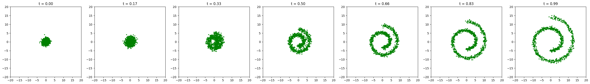

Flow Matching and Generative Flow Models (Personal Re-implementation)
This repository showcases my initial hands-on re-implementation from scratch of core concepts in Flow Matching and Generative Flow Models. This project served as a deep dive for personal learning, aiming to build intuition and practical understanding of how continuous normalizing flows operate.

This work is directly inspired by and attempts to re-implement foundational ideas from the excellent MIT course "Introduction to Flow Matching and Diffusion Models" (6.S184) available online. I've used their general wireframe for the MLP and abstract class concepts as a guide, focusing on a bare-bones implementation to grasp the mechanics.

Project Overview
This Jupyter Notebook is a step-by-step re-implementation of Flow Matching. The primary goal was to understand the process of learning a vector field that can transport samples from a simple base distribution (like a Gaussian) to a more complex target distribution along a continuous path.

Specifically, this project explores:

Alpha and Beta Functions: Implementations of various alpha and beta functions to define different Gaussian paths, aiming to understand their role in the flow process.
Multiple Flow Models:
A flow model trained to transform to a Swiss Roll distribution using a Gaussian path.
A flow model trained to transform to a Swiss Roll distribution using a Linear path.
A flow model trained to transform to an S-Curve distribution using a Linear path.
Synthetic datasets from sklearn.datasets (Swiss Roll and S-Curve) are used for clear visualization of the transformations. The focus was on building a working prototype to solidify my own learning, rather than creating a robust or production-ready system.

Technical Details
The notebook contains minimal mathematical explanations directly alongside the code to clarify the implementation choices. This reflects my personal learning process of connecting theory to code.

Key Libraries Used:
PyTorch: Used for defining and training the simple neural networks (MLPs) that learn the vector fields.
Scikit-learn: Utilized for generating the synthetic make_swiss_roll and make_s_curve datasets.
Matplotlib: For visualizing the distributions, paths, and training progress.
Getting Started
To run this project locally, follow these simple steps:

Clone the repository:
Bash

git clone 
cd 
Set up a virtual environment (recommended):
Bash

python -m venv venv
source venv/bin/activate # On Windows: venv\Scripts\activate
Install dependencies:
Bash

pip install -r requirements.txt
Launch Jupyter Notebook:
Bash

jupyter notebook
Then, open the main project notebook (e.g., flow_model_2D.ipynb).
Results & Visualizations
The notebook includes visualizations demonstrating:

Snapshots of sample transformations from the initial noise to the target distribution at different points along the learned flow path.
Basic plots of the training loss.
Final generated samples alongside the target distributions, showcasing the model's learning outcome.

Future Work
This project represents a foundational personal re-implementation. Areas for further development and deeper learning include:

Refactoring the code for improved robustness and modularity.
Exploring more sophisticated neural network architectures for the vector field.
Applying these concepts to more complex and higher-dimensional datasets.
A more thorough exploration of the theoretical nuances and advanced topics from the MIT course.
Acknowledgments
This project's fundamental understanding and initial implementation structure were greatly aided by the MIT course "Introduction to Flow Matching and Diffusion Models" (6.S184) by Peter Holderrieth and Ezra Erives. Their freely available lectures and materials provided invaluable guidance for this personal learning exercise.

Course Website: https://diffusion.csail.mit.edu/